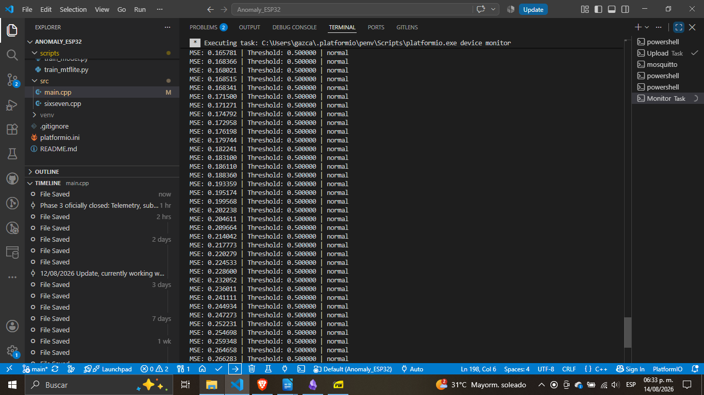

# ⚙️ IIoT Edge AI Pipeline for Vibration Anomaly Detection

> **Status:** ✅ Phase 1 Operational — Edge inference with quantized TFLite Micro on ESP32


## 📌 Overview

Industrial-grade **Edge AI** pipeline for condition monitoring of rotating machinery. The system performs **on-device inference** using a quantized autoencoder running directly on an ESP32 microcontroller, achieving **local anomaly detection without cloud dependency** — a core requirement for OT environments where latency, bandwidth, and data sovereignty matter.

The pipeline implements the full chain from **raw vibration signal → DSP feature extraction → ML inference → threshold-based alert → MQTT telemetry**, all within the memory constraints of a $5 microcontroller.

### Why this matters for OT/ICS
- **Local decision-making**: the device decides "normal" vs "anomaly" on-chip, even if WiFi goes down.
- **Bandwidth-efficient**: only 6 floats + a status byte per inference cycle, vs. streaming raw vibration.
- **Security-first design**: ready for mTLS/X.509 upgrade (see Roadmap).
- **Field-calibrated threshold**: anomaly threshold computed against the *deployed* INT8 model, not the idealized float one.

---

## 🏗️ Architecture
─────────────────────┐ ┌──────────────────────────────────────────┐ ┌─────────────────┐
│ MPU-6050 / Mock │───▶│ ESP32 (Edge Node) │───▶│ MQTT Broker │
│ 3-axis @ 100 Hz │ │ • DSP: RMS + StdDev (N=64 window) │ │ (Mosquitto) │
└─────────────────────┘ │ • TFLite Micro INT8 autoencoder │ └────────┬────────┘
│ • Field-calibrated threshold │ │
│ • Local anomaly decision │ ▼
│ • MQTT publish (telemetry + alerts) │ ┌─────────────────┐
└──────────────────────────────────────────┘ │ Python Subscr. │
│ (monitoring) │
└─────────────────┘


### Pipeline stages

1. **Signal acquisition** — I²C read of triaxial accelerometer at 100 Hz (simulated with statistical mock during development).
2. **DSP feature extraction** — Rolling window of N=64 samples; computes RMS and σ for each axis (6 features total).
3. **Standardization** — Z-score normalization with `mean`/`scale` exported from the Python `StandardScaler` used in training.
4. **On-device inference** — Quantized INT8 autoencoder (6 → 3 → 6) running via `tflite::MicroInterpreter` with a `tensor_arena` of 4 KB.
5. **Anomaly scoring** — MSE between input and reconstruction; compared against a field-calibrated threshold.
6. **Decision + transport** — Local `NORMAL`/`ANOMALY` label, published over MQTT with the raw MSE for downstream analytics.

---

## 🧠 The ML model

- **Architecture:** Dense autoencoder (6 → 16 → 3 → 16 → 6) trained on normal operating data only.
- **Training stack:** TensorFlow 2.x → TFLite conversion → **full integer quantization** (INT8 weights + INT8 ops).
- **I/O type:** float32 input/output (chip sends floats, TFLM handles quantize/dequantize internally).
- **Size:** ~3.6 KB of weights embedded in `model_data.h` as a `const unsigned char[]`.
- **Op resolver:** `MicroMutableOpResolver<6>` registering only the ops the model uses (`FullyConnected`, `Relu`, `Reshape`, `Dequantize`, `Quantize`).

### Field calibration (production ML best practice)

The anomaly threshold was **NOT** derived from the idealized float32 model in Python. It was calibrated against the **exact INT8 artifact deployed on the chip**, by sweeping the normal-distribution mock across all its phases and taking a conservative 2× margin over the observed max MSE:

Normal band observed on-device: 0.14 – 0.27
Field-calibrated threshold: 0.50
Anomaly under ×3 stress: ~8,000+


This gives ~2× headroom above normal and ~4 orders of magnitude separation from true anomalies — **no alarm chattering, robust detection margin.**

---

## 🛠️ Tech Stack

| Layer | Technology |
|---|---|
| Firmware | C++17, PlatformIO, Arduino framework for ESP32 |
| Edge ML | TensorFlow Lite for Microcontrollers (INT8 quantized) |
| DSP | Rolling RMS / StdDev on ring buffer |
| Transport | MQTT 3.1.1 over WiFi (`PubSubClient`) |
| Broker | Mosquitto 2.1.2 (local) |
| Training | TensorFlow 2.x, NumPy, scikit-learn, joblib |
| Host subscriber | Python 3, `paho-mqtt` |

---

## 🚀 Getting Started

### Prerequisites

- PlatformIO Core or VS Code + PlatformIO extension
- Python 3.9+ with `numpy`, `tensorflow`, `scikit-learn`, `paho-mqtt`
- ESP32 DevKit v1 (or compatible)

### 1. Clone and configure

```bash
git clone https://github.com/tu-usuario/Anomaly_ESP32.git
cd Anomaly_ESP32
cp firmware/include/secrets.example.h firmware/include/secrets.h
# Edit secrets.h with your WiFi SSID, password, and MQTT broker IP

2. Train the model (optional — pre-trained weights included)
python scripts/train_mtflite.py          # trains autoencoder + quantizes to INT8
python scripts/exports_headers.py        # generates model_data.h
python scripts/scaler_extract.py         # prints SCALER_* constants for main.cpp

3. Flash the firmware
pio run -e esp32dev -t upload
pio device monitor -b 115200

Expected output (normal operation):

--- IIOT EDGE AI PIPELINE INITIALIZED ---
Wi-Fi connected. IP: 192.168.101.107
[OK] TFLite loaded. Input: 6 dims, Output: 6 dims
MSE: 0.151748 | Threshold: 0.500000 | normal
MSE: 0.196506 | Threshold: 0.500000 | normal
MSE: 0.251706 | Threshold: 0.500000 | normal

4. Subscribe to telemetry (optional)
python scripts/subscriber_ai.py


## 📊 Demo — Two-state validation
A detector is only as good as its ability to shout when it should shout. The pipeline was validated in both regimes:
<p align="center">
  
  
</p>
State
Typical MSE
Decision
MQTT
Normal operation
0.14 – 0.27
normal
telemetry only
Simulated fault (×3 features)
8,000+
*** ANOMALY ***
telemetry + >> ALERT published on MQTT
📸 Add screenshots of the serial monitor in both states to /docs/ for full visual proof.

🗺️ Roadmap
Phase 1 — Firmware + DSP + mock data + edge inference ✅
Phase 2 — Python training pipeline + INT8 quantization ✅
Phase 2.5 — Field threshold calibration ✅
Phase 3 — Real motor data acquisition + labeling (F3–F4)
Phase 4 — mTLS/X.509 mutual authentication (see below)
Phase 5 — Wireshark capture: plain MQTT vs. mqtt-over-TLS traffic comparison
Phase 6 — Heap profiling: TLS active vs. TLS inactive (documenting the real cost)
🔒 Security Considerations
Current state
Transport: MQTT over plain TCP (1883). Not production-ready for OT.
Authentication: none.
Planned: mTLS/X.509 upgrade
The next major iteration will implement mutual TLS so that:
The ESP32 validates the broker's certificate (prevents MITM).
The broker validates the ESP32's client certificate (prevents device spoofing).

All telemetry is encrypted end-to-end (no plaintext MQTT on the wire).
This aligns with IEC 62443-3-3 requirements for industrial communication security and is the de-facto standard for secure IIoT deployments. See docs/MTLS_PLAN.md (planned) for the full threat model and 
implementation path.

📚 References
TensorFlow Lite for Microcontrollers — official docs
IEC 62443-3-3 — System security requirements and security levels
NIST SP 800-82 — Guide to Industrial Control Systems Security
MQTT v3.1.1 specification

📄 License
MIT — see LICENSE.
Built as part of a multi-project portfolio toward an Industrial Edge AI & OT Security Engineer profile. See ROADMAP.md for the broader context.

